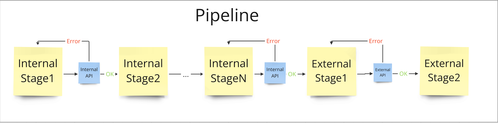

# Разработка высоконагруженной системы с ненадежным потребителем
Подготовил Потоцкий Михаил

## Описание системы

В рамках данного проекта необходимо разработать систему регистрации чеков, которая будет способна обрабатывать чек, проходя через ряд стадий. Особенности системы:

- Каждая стадия представлена одним или несколькими HTTP-запросами, и зависит от результата выполнения предыдущей.
- Последние этапы обработки чека вызывают API ненадежного внешнего потребителя.
- Каждая стадия может завершиться с ошибкой, в таком случае, если ошибка была нетерминальной (например, 429 Too Many Requests), нужно через некоторое время возобновить пайплайн регистрации чека, начиная со стадии, на которой он остановился во время прошлой попытки. 
- Система должна быть реализована таким образом, чтобы она была устойчива к сбоям, могла продолжать работу после восстановления сервисов и поддерживала высокую степень наблюдаемости. 

Схематически система должна выглядеть следующим образом:

## Задачи и цель проекта

Задачи проекта следующие:

- Реализация системы с использованием Procaas
- Реализация системы с использованием Procaas и очереди задач
- Реализация системы с использованием Temporal
- Сравнение потребляемых ресурсов полученных реализаций. Главными характеристиками для сравнения будут потребление CPU, занимаемое место на диске, длительность исполнения пайплайна при отсутствии ошибок, а также скорость обработки скопившихся после недоступности внешнего API задач.

Цель - получить наилучшую по показателям систему и начать использовать ее в production.

## Варианты реализации

Первым в голову приходит идея использовать очередь задач, но из-за того, что система должна уметь перезапускать пайплайн с определенной стадии, одна очередь не подходит, потому что нет возможности сохранять контекст исполнения при падении. Можно использовать для каждой стадии отдельную очередь, чтобы при нетерминальной ошибке перезапускать задачу с начала, но в таком случае у нас будет слишком много точек отказа, возникнут проблемы с observability, потому что очень сложно будет отследить процесс исполнения одного пайплайна.

Таким образом для реализации системы нужен инструмент-надстройка над очередью задач, в который уже будет встроена возможность восстанавливать пайплайн с места ошибки. Предлагается два варианта: внутренний инструмент Procaas и опенсорсный workflow engine Temporal.

### Procaas

Procaas - это сервис для выполнения динамических сценариев, описанных в виде Workflow-схем. ProcaaS обеспечивает высокую доступность, горизонтальную масштабируемость и низкие задержки, а также эффективные обработки большого кол-ва событий. На данный момент система на Procaas уже реализована, и можно отметить большой минус данного сервиса. В случаях, когда внешний потребитель недоступен, в очереди начинают копиться задачи, которые упали на последних стадиях. Из-за них появляются задержки в выполнении новых задач, которые еще на первых стадиях и могут обработаться, потому что внутренние API доступны. Еще один небольшой минус procaas заключается в том, что workflow-схемы для него должны быть описаны в yaml файлах на специально разработанном языке программирования, из-за чего разработка замедляется.

### Procaas + очередь задач

Чтобы решить проблему с задержкой обработки первых стадии регистрации чеков при недоступности внешнего потребителя был предложен еще один вариант: вынести стадии с походами во внешнее API в отдельную очередь задач, а все остальные оставить в Procaas. Таким образом мы больше не будем блокировать первые стадии, но ухудшим observability системы.

### Temporal

Temporal - это опенсорсный workflow engine, который позволяет делать retry пайплайна начиная с определенной стадии. К тому же он предоставляет удобный интерфейс для преобразования ошибок в NonRetryableError, чтобы пайплайн, окончившийся терминальной ошибкой (например, 400 Bad Request), больше не перезапускался. Для реализации системы на Temporal нужно описать protobuf, реализовать интерфейсы, написанные кодогенерацией, поднять кластер и настроить подключения воркеров, выполняющих workflow, к этому кластеру. Код можно писать на одном из шести поддерживаемых языков. В нашем случае выбран был Golang.

## Заключение

Разработка высоконагруженной системы с интеграцией ненадежного потребителя представляет собой сложную задачу, которая требует тщательного планирования и выбора подходящих инструментов и технологий. В данной статье мы рассмотрели несколько подходов к реализации этой системы, но судить о том, какая из них лучше, можно будет только после проведения нагрузочного тестирования.
